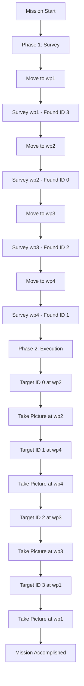

# ROS 2 PlanSys2 ArUco Explorer


An autonomous mobile robot capability demo that combines **PlanSys2 (PDDL planning)**, **Nav2 (Navigation)**, and **OpenCV (ArUco Perception)** in a Gazebo simulation. The robot executes a **two-phase mission**: first surveying all locations to detect ArUco markers, then returning to take high-quality pictures of each detected marker.

---

## 📦 Package Overview

| Package Name | Description |
| :--- | :--- |
| **`arucobot_description`** | URDF model (aruco_bot_diff.xacro), Gazebo plugins, and physical properties. |
| **`arucobot_gazebo`** | Gazebo world files, ArUco marker models, ros_gz_bridge, and simulation launch scripts. |
| **`arucobot_perception`** | Python node for detecting ArUco markers using OpenCV and publishing detections. |
| **`arucobot_navigation`** | Nav2 configuration (nav2_params.yaml), map files, and navigation launch scripts. |
| **`arucobot_planning`** | PlanSys2 PDDL domain/problem files and Action Executors (move, survey, take_picture). |

---

## 🛠️ Installation

### 1. Prerequisites
Ensure you have **ROS 2 Jazzy** installed with Gazebo Harmonic.

### 2. Install Dependencies
```bash
sudo apt update
sudo apt install ros-jazzy-navigation2 \
                 ros-jazzy-nav2-bringup \
                 ros-jazzy-slam-toolbox \
                 ros-jazzy-plansys2-bringup \
                 ros-jazzy-ros-gz-sim \
                 ros-jazzy-ros-gz-bridge \
                 ros-jazzy-robot-localization \
                 ros-jazzy-cv-bridge \
                 python3-opencv \
                 python3-opencv-contrib
```

### 3. Clone & Build

```bash
mkdir -p ~/ros2_ws/src
cd ~/ros2_ws/src
# Clone this repository
git clone https://github.com/yourusername/ros2-plansys2-aruco-explorer.git .

cd ~/ros2_ws
colcon build --symlink-install
source install/setup.bash
```

---

## 🚀 Usage

### Quick Start (Automated Mission)

The easiest way to run the complete mission is using the **Mission Controller**:

```bash
# Terminal 1: Launch Gazebo simulation
ros2 launch arucobot_gazebo simulation.launch.py

# Terminal 2: Launch Navigation stack
ros2 launch arucobot_navigation navigation.launch.py

# Terminal 3: Start ArUco detector
ros2 run arucobot_perception aruco_detector_node

# Terminal 4: Launch PlanSys2 and action executors
ros2 launch arucobot_planning planning.launch.py

# Terminal 5: Run automated mission controller
cd ~/ros2_ws/src/ros2-plansys2-aruco-explorer/arucobot_planning/scripts
python3 mission_controller.py
```

### Manual Control (Advanced)

For manual mission planning, use the PlanSys2 terminal:

```bash
ros2 run plansys2_terminal plansys2_terminal
```

**Example commands:**

```lisp
# Survey a single waypoint
set goal (and (surveyed wp1))
run

# Take picture at a waypoint
set goal (and (picture_taken wp1))
run

# Multiple goals
set goal (and (surveyed wp1) (surveyed wp2) (picture_taken wp1))
run
```

---

## 🧠 System Architecture

### Two-Phase Mission Strategy

The mission controller implements an intelligent **explore-then-execute** workflow:

#### **Phase 1: Survey (Exploration)**
- Robot visits **all predefined waypoints** (wp1, wp2, wp3, wp4)
- At each location, executes `survey` action to scan for ArUco markers
- Records marker IDs and their corresponding waypoints
- Example output:
  ```
  --- STARTING PHASE 1: SURVEY ---
  Surveying wp1... --> RECORDED: Marker ID 3 found at wp1
  Surveying wp2... --> RECORDED: Marker ID 0 found at wp2
  Surveying wp3... --> RECORDED: Marker ID 2 found at wp3
  Surveying wp4... --> RECORDED: Marker ID 1 found at wp4
  ```

#### **Phase 2: Execution (Task Completion)**
- Robot returns to **only locations with detected markers**
- Executes `take_picture` action to capture high-quality images
- Example output:
  ```
  --- STARTING PHASE 2: EXECUTION ---
  Targeting ID 0 at wp2 >>> ID 0 COMPLETED.
  Targeting ID 1 at wp4 >>> ID 1 COMPLETED.
  Targeting ID 2 at wp3 >>> ID 2 COMPLETED.
  Targeting ID 3 at wp1 >>> ID 3 COMPLETED.
  MISSION ACCOMPLISHED.
  ```

### PDDL Domain (`domain.pddl`)

The robot operates using **three durative actions**:

1. **`move`**: Navigates between connected waypoints using **Nav2**.
   - *Duration:* 10 time units
   - *Precondition:* Robot at `from` waypoint, waypoints are `connected`
   - *Effect:* Robot moves from `from` to `to` waypoint

2. **`survey`**: Rotates in place and scans for ArUco markers.
   - *Duration:* 5 time units
   - *Precondition:* Robot at waypoint `w`
   - *Effect:* Waypoint `w` is marked as `surveyed`, marker IDs recorded

3. **`take_picture`**: Centers on detected marker and captures image.
   - *Duration:* 10 time units
   - *Precondition:* Robot at waypoint `w`
   - *Effect:* Picture taken at waypoint `w`

### Action Executors

Action executors are implemented in `arucobot_planning/src/`:

- **`move_action_node.cpp`**: Interfaces with Nav2's `NavigateToPose` action
- **`survey_action_node.cpp`**: Rotates robot 360° and monitors ArUco detections
- **`take_picture_action_node.cpp`**: Centers on marker and triggers camera capture

### Perception Pipeline

The `aruco_detector_node.py` subscribes to `/camera/image_raw`, detects ArUco markers using OpenCV, and publishes on `aruco_markers`:
- Detected marker IDs
- Marker poses (3D position/orientation)

---

## 🗺️ Gazebo World

The simulation includes:
- **ArUco World** (`aruco_world.world`) with 4 ArUco markers (IDs 0-3)
- Differential drive robot with 2D LIDAR and RGB camera
- Pre-mapped environment (`maps/my_map.yaml`)
- EKF-based odometry fusion (`config/ekf.yaml`)

**Waypoint-Marker Mapping:**
- `wp1`: **Marker ID 3**
- `wp2`: **Marker ID 0**
- `wp3`: **Marker ID 2**
- `wp4`: **Marker ID 1**

---

## 📁 Key Configuration Files

- **Navigation**: `arucobot_navigation/config/nav2_params.yaml`
- **PDDL Domain**: `arucobot_planning/pddl/domain.pddl`
- **PDDL Problem**: `arucobot_planning/pddl/problem.pddl`
- **Mission Controller**: `arucobot_planning/scripts/mission_controller.py`
- **ArUco Parameters**: `arucobot_perception/config/aruco_params.yaml`
- **Gazebo Bridge**: `arucobot_gazebo/config/ros_gz_bridge.yaml`
- **Robot Model**: `arucobot_description/urdf/aruco_bot_diff.xacro`
- **EKF Config**: `arucobot_gazebo/config/ekf.yaml`

---

## 📊 Mission Workflow



---

## 🎯 Features

- ✅ **Automated two-phase mission planning** (Survey → Execute)
- ✅ **Dynamic waypoint graph** (defined in PDDL problem file)
- ✅ **Real-time ArUco marker detection** (OpenCV 4.x with ArUco module)
- ✅ **Nav2 integration** for autonomous navigation
- ✅ **PlanSys2 task planning** with PDDL 2.1
- ✅ **Gazebo Harmonic simulation** with realistic sensors
- ✅ **EKF localization** for accurate positioning
- ✅ **Intelligent marker tracking** (only revisits locations with detections)

---
