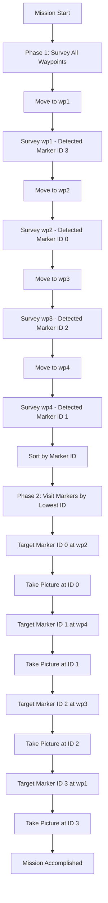

# ROS 2 PlanSys2 ArUco Explorer


An autonomous mobile robot system that combines **PlanSys2 (PDDL planning)**, **Nav2 (Navigation)**, and **OpenCV (ArUco Perception)** to autonomously detect and interact with ArUco markers. The robot executes a **two-phase mission**: first surveying all predefined waypoints to discover marker locations, then systematically visiting each detected marker in ascending ID order to capture images.

**📚 Documentation:** https://deepwiki.com/mohamedeyaad/ros2-plansys2-aruco-explorer

---
## 🎥 Demo Video

[](https://www.youtube.com/watch?v=UrN_7yXdufQ)

**Watch the robot autonomously survey waypoints, detect ArUco markers, and capture images in marker ID order!**

---

## 📋 Mission Overview

The robot operates in a known environment with **4 predefined waypoints** and discovers ArUco markers at these locations:

| Waypoint | Coordinates | Marker ID |
|----------|-------------|-----------|
| **wp1** | (-6.0, -6.0) | 3 |
| **wp2** | (-6.0, 6.0) | 0 |
| **wp3** | (6.0, -6.0) | 2 |
| **wp4** | (6.0, 6.0) | 1 |

**Key Requirements:**
- ✅ Visit all 4 waypoints during survey phase
- ✅ Detect ArUco marker at each waypoint
- ✅ Record marker ID and location mapping
- ✅ Visit detected markers in **ascending ID order** (0 → 1 → 2 → 3)
- ✅ Capture and modify images at each marker location
- ✅ Use **PlanSys2** for mission planning and action coordination

---

## 📦 Package Overview

| Package Name | Description |
| :--- | :--- |
| **`arucobot_description`** | URDF model (aruco_bot_diff.xacro), Gazebo plugins, and physical properties. |
| **`arucobot_gazebo`** | Gazebo world files, ArUco marker models, ros_gz_bridge, and simulation launch scripts. |
| **`arucobot_perception`** | Python node for detecting ArUco markers using OpenCV and publishing detections. |
| **`arucobot_navigation`** | Nav2 configuration (nav2_params.yaml), map files, and navigation launch scripts. |
| **`arucobot_planning`** | PlanSys2 PDDL domain/problem files and Action Executors (move, survey, take_picture). |
| **`arucobot_interfaces`** | Custom message definitions for ArUco detections (e.g., marker ID and pose). |

---

## 🛠️ Installation

### 1. Prerequisites
Ensure you have **ROS 2 Jazzy** installed with Gazebo Harmonic.

### 2. Install Dependencies

```bash
sudo apt update
sudo apt install ros-jazzy-navigation2 \
                 ros-jazzy-nav2-bringup \
                 ros-jazzy-slam-toolbox \
                 ros-jazzy-plansys2-* \
                 ros-jazzy-ros-gz-sim \
                 ros-jazzy-ros-gz-bridge \
                 ros-jazzy-cv-bridge \
                 python3-opencv
```

### 3. Clone & Build

```bash
mkdir -p ~/ros2_ws/src
cd ~/ros2_ws/src
# Clone this repository
git clone https://github.com/mohamedeyaad/ros2-plansys2-aruco-explorer.git

cd ~/ros2_ws
colcon build --symlink-install
source install/setup.bash
```

### 4. ⚠️ Environment Setup (Important)

For Gazebo to locate the custom ArUco marker models, you must strictly add the models directory to the `GZ_SIM_RESOURCE_PATH`.

Run this command in your terminal before launching the simulation (or add it to your `~/.bashrc`):

```bash
export GZ_SIM_RESOURCE_PATH=/home/$USER/ros2_ws/src/ros2-plansys2-aruco-explorer/arucobot_gazebo/models/
```

**To persist across sessions, add to your `.bashrc`:**

```bash
echo 'export GZ_SIM_RESOURCE_PATH=/home/$USER/ros2_ws/src/ros2-plansys2-aruco-explorer/arucobot_gazebo/models/' >> ~/.bashrc
source ~/.bashrc
```

---

## 🚀 Usage

### Quick Start (Automated Mission)

The easiest way to run the complete mission is using the **Mission Controller**:

```bash
# Terminal 1: Launch Simulation + Navigation
ros2 launch arucobot_navigation navigation.launch.py

# Terminal 2: Start ArUco detector
ros2 run arucobot_perception aruco_detector_node

# Terminal 3: Launch PlanSys2 and action executors
ros2 launch arucobot_planning planning.launch.py

# Terminal 4: Run automated mission controller
# Make script executable (first time only)
chmod +x ~/ros2_ws/src/ros2-plansys2-aruco-explorer/arucobot_planning/scripts/mission_controller.py
ros2 run arucobot_planning mission_controller.py
```

### Manual Control (Advanced)

For manual mission planning, use the PlanSys2 terminal:

```bash
ros2 run plansys2_terminal plansys2_terminal
```

**Example commands:**

```lisp
# Survey a single waypoint
set goal (and (surveyed wp1))
run

# Take picture at a waypoint
set goal (and (picture_taken wp1))
run

# Complete mission
set goal (and (surveyed wp1) (surveyed wp2) (surveyed wp3) (surveyed wp4) (picture_taken wp1) (picture_taken wp2) (picture_taken wp3) (picture_taken wp4))
run
```

---

## 🧠 System Architecture

### Two-Phase Mission Strategy

The mission controller implements an intelligent **explore-then-execute** workflow:

#### **Phase 1: Survey (Marker Discovery)**
- Robot sequentially visits all **4 waypoints** (wp1, wp2, wp3, wp4)
- At each location, executes `survey` action to scan for ArUco markers using the camera
- Records detected **marker ID** and its **waypoint location**
- Only waypoints with detected markers are scheduled for Phase 2
- Example output:
  ```
  --- STARTING PHASE 1: SURVEY ---
  Moving to wp1... Survey wp1 --> MARKER DETECTED: ID 3
  Moving to wp2... Survey wp2 --> MARKER DETECTED: ID 0
  Moving to wp3... Survey wp3 --> MARKER DETECTED: ID 2
  Moving to wp4... Survey wp4 --> MARKER DETECTED: ID 1
  --- PHASE 1 COMPLETE ---
  Discovered markers: {0: wp2, 1: wp4, 2: wp3, 3: wp1}
  ```

#### **Phase 2: Execution (Lowest ID First)**
- Robot visits **detected markers in ascending ID order**: ID 0 → 1 → 2 → 3
- At each marker location, executes `take_picture` action to:
  - Center on the detected marker
  - Capture an image from the camera
  - Apply image processing/modification
- Example output:
  ```
  --- STARTING PHASE 2: EXECUTION ---
  Processing ID 0: Moving to wp2... Taking picture at ID 0 COMPLETED
  Processing ID 1: Moving to wp4... Taking picture at ID 1 COMPLETED
  Processing ID 2: Moving to wp3... Taking picture at ID 2 COMPLETED
  Processing ID 3: Moving to wp1... Taking picture at ID 3 COMPLETED
  --- MISSION ACCOMPLISHED ---
  ```

### PDDL Domain (`domain.pddl`)

The robot operates using **three durative actions**:

1. **`move`**: Navigates between connected waypoints using **Nav2**.
   - *Duration:* 10 time units
   - *Precondition:* Robot at `from` waypoint, waypoints are `connected`
   - *Effect:* Robot moves from `from` to `to` waypoint

2. **`survey`**: Rotates in place and scans for ArUco markers.
   - *Duration:* 5 time units
   - *Precondition:* Robot at waypoint `w`
   - *Effect:* Waypoint `w` is marked as `surveyed`, marker IDs recorded

3. **`take_picture`**: Centers on detected marker and captures image.
   - *Duration:* 10 time units
   - *Precondition:* Robot at waypoint `w` where a marker was `surveyed`
   - *Effect:* Picture `picture_taken` at waypoint `w`

### Action Executors

Action executors are implemented in `arucobot_planning/src/`:

- **`move_action_node.cpp`**: Interfaces with Nav2's `NavigateToPose` action to move between waypoints
- **`survey_action_node.cpp`**: Rotates robot 360° and monitors `/aruco_markers` topic for detections
- **`take_picture_action_node.cpp`**: Subscribes to camera feed and processes detected markers

### Perception Pipeline

The `aruco_detector_node.py` subscribes to `/camera/image_raw`, detects ArUco markers using OpenCV, and publishes on `/aruco_markers`:
- Detected **marker IDs** (0-3)
- Marker **3D poses** (position and orientation)

---
## 🗺️ Gazebo World

The simulation includes:
- **ArUco Environment** with 4 distinct ArUco markers (IDs 0, 1, 2, 3)
- Differential drive robot equipped with:
  - RGB camera (front-mounted for marker detection)
  - 2D LiDAR (for localization and obstacle avoidance)
  - Odometry sensors
- Pre-mapped environment (`maps/my_map.yaml`)

**Waypoint Locations:**
- `wp1`: (-6.0, -6.0) containing Marker ID 3
- `wp2`: (-6.0, 6.0) containing Marker ID 0
- `wp3`: (6.0, -6.0) containing Marker ID 2
- `wp4`: (6.0, 6.0) containing Marker ID 1

---

## 🗺️ Environment Mapping

The pre-mapped environment (`maps/my_map.yaml`) was created using **SLAM Toolbox**.

**Mapping procedure:**
1. Launch the simulation: 
   ```bash
    ros2 launch arucobot_gazebo simulation.launch.py
   ```
2. In a new terminal, start SLAM: 
   ```bash
    ros2 launch slam_toolbox online_async_launch.py
   ```
3. In another terminal, launch teleop to manually drive the robot:
   ```bash
   ros2 run teleop_twist_keyboard teleop_twist_keyboard
   ```
4. Manually drive the robot around the environment to explore all areas
5. Once mapping is complete, save the map using Nav2's map saver:
   ```bash
   ros2 run nav2_map_server map_saver_cli -f my_map
   ```
6. The generated map files (`my_map.pgm` and `my_map.yaml`) are saved to `arucobot_navigation/maps/`

**Note:** The provided `my_map.yaml` is already included in the repository and pre-configured for the Gazebo world. You only need to remap if you modify the world layout or add obstacles.

---

## 📊 Mission Workflow



---

## 🎯 Features

- ✅ **Autonomous two-phase mission** (Survey all waypoints → Execute by marker ID)
- ✅ **Ascending ID priority** (visits markers in order: 0, 1, 2, 3)
- ✅ **Real-time ArUco marker detection** (OpenCV with marker pose estimation)
- ✅ **Dynamic marker discovery** (records location of each detected marker)
- ✅ **Nav2 integration** for autonomous waypoint navigation
- ✅ **PlanSys2 PDDL planning** with durative actions and state tracking
- ✅ **Gazebo Harmonic simulation** with realistic robot and sensor models
- ✅ **Image processing capability** (camera-based marker interaction)

---
